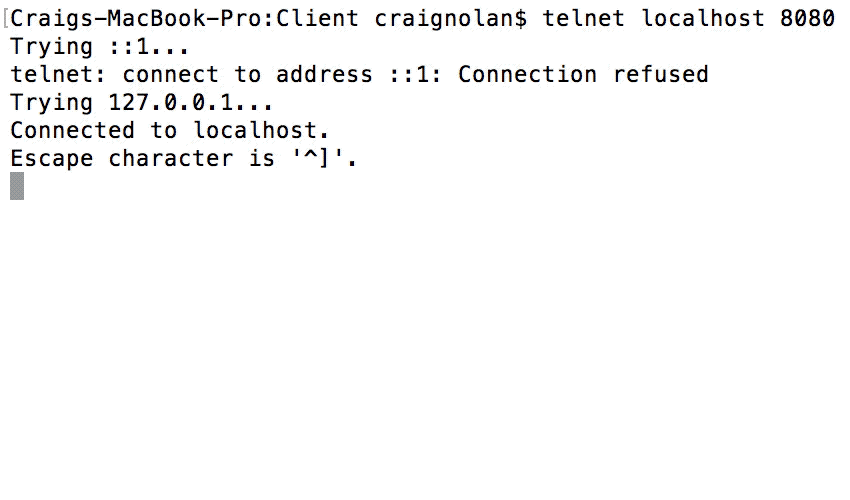
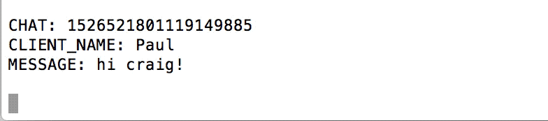

# Chat Server Submission
## Introduction
This project was part of a TCD college assignment to create a chat server for clients to chat using a protocol to perform actions in a chatroom just as join a chatroom, send chat messages, leave chatrooms & disconnect from the server. Also a "HELO base" message is sent which server returns the IP of TCD Macneill machine and student number.

I will discuss the protocols and showcase clients using the chat server below.

## HELO base Message
Sending the HELO base message required the user to send the following commands to the server

```
HELO text\n
```

#### User sending HELO text Message



## Joining Chatrooms
Joining a chatroom required a user to to send the following commands to the server once they connected (I implemented for TCP).

```
JOIN_CHATROOM: [chatroom name]
CLIENT_IP: [0 for TCP]
PORT: [0 for TCP]
CLIENT_NAME: [string Handle to identifier client user]
```

### User Joining


## Sending Chat Messages
Sending a chat message to a chatroom required a user to to send the following commands to the server once they were a member of a chatroom

```
CHAT: [ROOM_REF]
CLIENT_NAME: [string identifying client user]
MESSAGE: [string terminated with '\n\n']
```

### User Chatting

 

## Leaving Chatrooms
Leaving a chatroom required a user to to send the following commands to the server once they were a member of that chatroom

```
LEAVE_CHATROOM: [ROOM_REF]
JOIN_ID: [integer previously provided by server on join]
CLIENT_NAME: [string Handle to identifier client user]
```

### User Leaving a Chatroom


## Disconnecting From Server
Disconnecting from the server required a user to to send the following commands to the server

```
DISCONNECT: [0 for TCP]
PORT: [0 for TCP]
CLIENT_NAME: [string handle to identify client user]
```

### User Disconnecting from Server


### Running on your machine

1. Clone this repo `git clone https://craig1901/complexity_api`
2. `stack build` inside the directory
3. `bash run <port>` to set up a local server on your machine on the given post
4. `telnet localhost <port>` to make a connection to the server and start chatting!

## Notes Regarding given test service for this Assignment 

All runnable code is on restart branch of this repository!

**Got 64% in the tests:**

* I couldn't figure out how to get the HELO base message to get sent fully back, all the client got back was the letter H from my response which was wierd I thought (again works when I run on my computer!)
* Test suite wanted to be sent back a chat message that a client has left a room when they disconnected, mine disconnects and clients are removed from their respective chatrooms

